🛍️ GenZ Wardrobe

GenZ Wardrobe is a modern e-commerce platform with separate apps for Users and Admins. Built with Kotlin & Jetpack Compose, it offers a seamless shopping experience with advanced filtering, order tracking, and an intuitive admin panel for managing products and orders.

📌 Features

User App

- ✅ Modern UI with Jetpack Compose
- ✅ Browse products with dynamic filters (Price, Brand, Fabric, Occasion, Color)
- ✅ Secure checkout with Razorpay Payment Gateway
- ✅ Order tracking with status updates
- ✅ Wishlist & Cart Management
- ✅ User Authentication (Login/Signup)
- ✅ Wallet feature for quick payments

Admin App

- ✅ Dashboard to manage products, orders, and users
- ✅ Real-time order tracking & status updates
- ✅ Add Product
- ✅ Secure Admin Login

🚀 Tech Stack

Language: Kotlin

UI: Jetpack Compose

Database: Firebase Database & Room Database

Payment Gateway: Razorpay

State Management: ViewModel & MutableStateFlow

Authentication: Firebase Auth

📂 Project Structure

GenZ-Wardrobe/
- │── UserApp/      # User-facing e-commerce app
- │── AdminApp/     # Admin panel for managing orders & products
- │── README.md     # Project documentation
- │── .gitignore    # Git ignore file

🛠️ Installation & Setup

Clone the Repository

git clone https://github.com/your-username/GenZ-Wardrobe.git
cd GenZ-Wardrobe

Open in Android Studio

Open Android Studio

Select Open an Existing Project

Navigate to GenZ-Wardrobe/UserApp/ or GenZ-Wardrobe/AdminApp/

Click Open

Run the App

Connect an Android device or use an emulator.

Click Run ▶️ in Android Studio.

## 🏆 Screenshots
User App

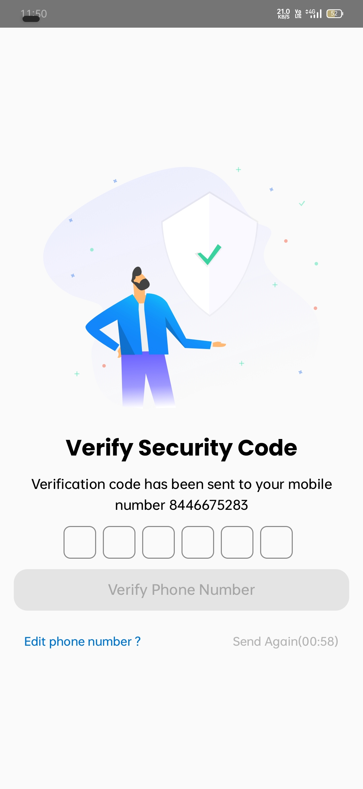
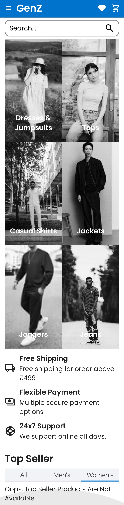
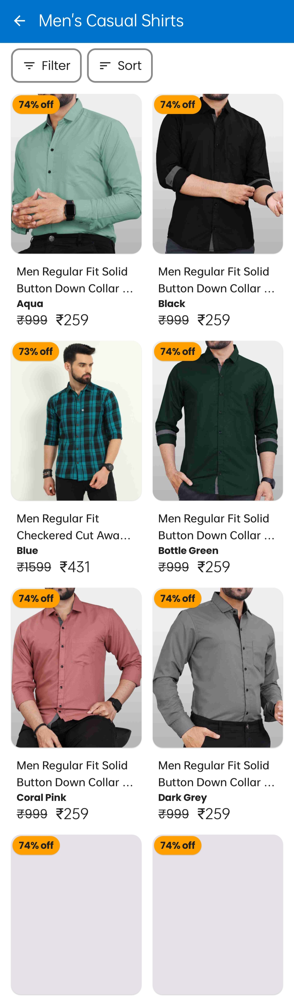
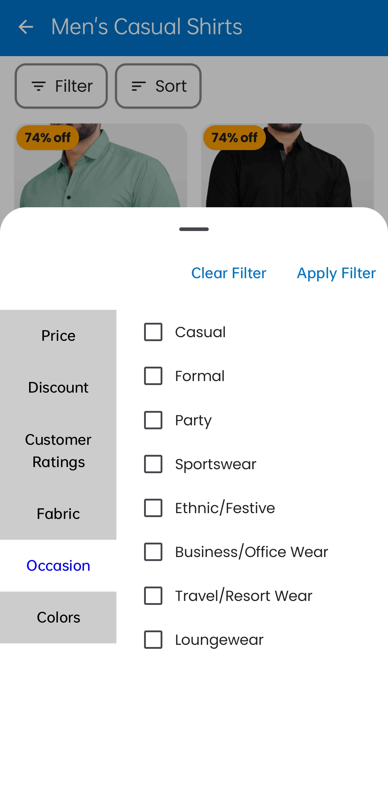
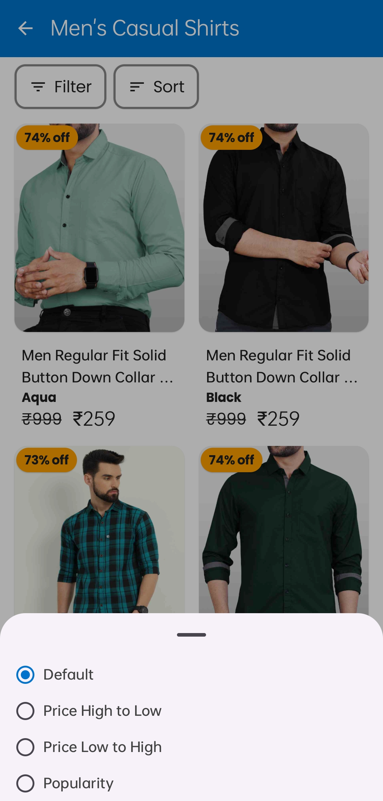
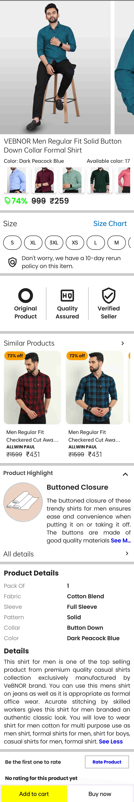
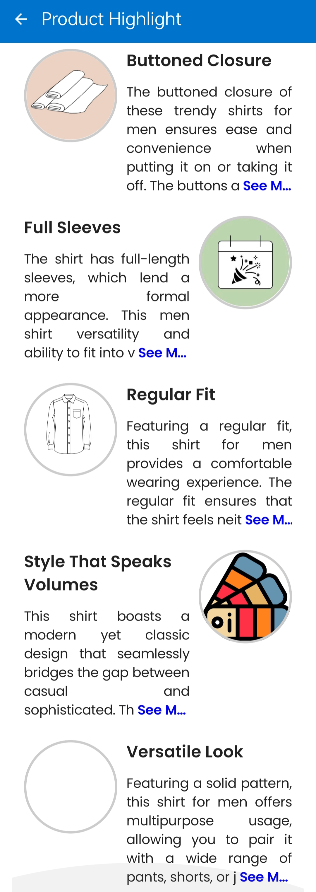
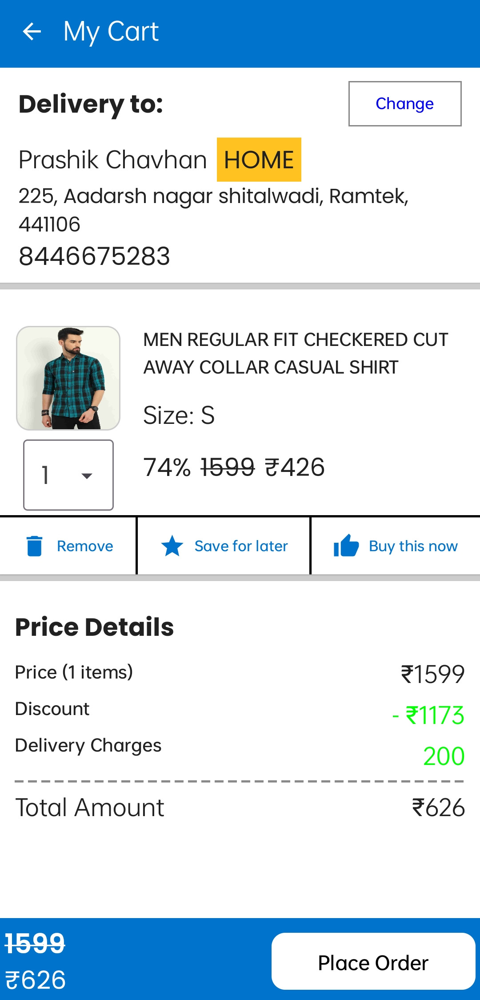
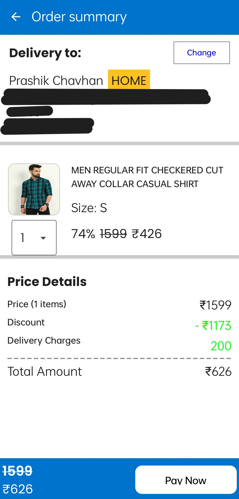
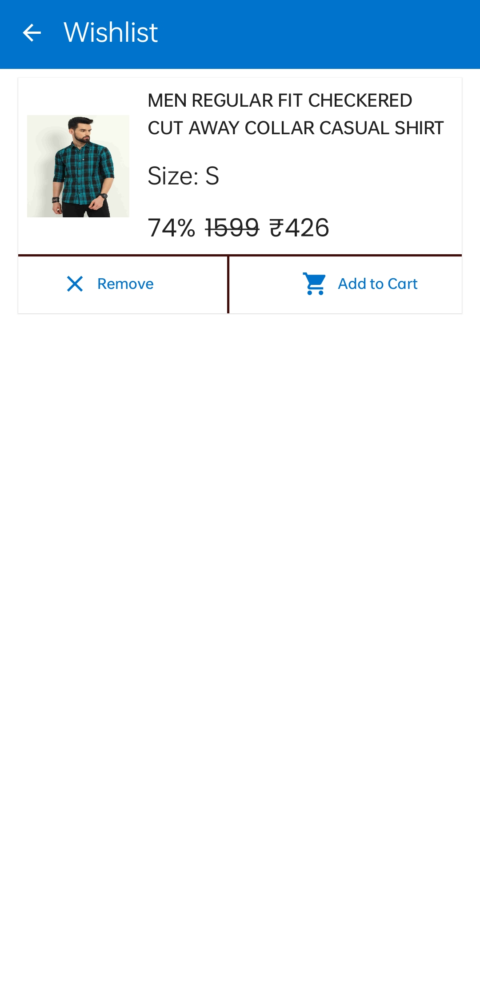

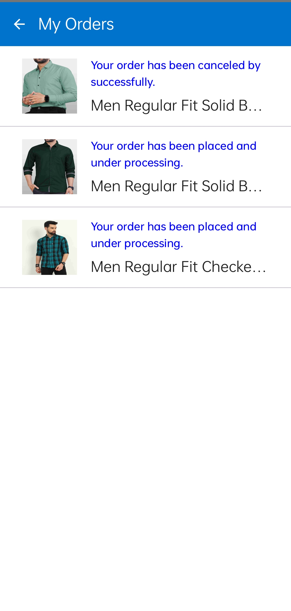
 

Admin App

 

🤝 Contributing

Contributions are welcome! Follow these steps:

Fork the repo

Create a new branch (feature-xyz)

Commit your changes

Push to GitHub and create a Pull Request

📧 Contact

For any queries, feel free to reach out:
📩 Email: p6.chavhan@gmail.com
🔗 GitHub: Prashik-Chavhan
🔗 LinkedIn: your-profile

⭐ Don't forget to star the repository if you like it! ⭐

